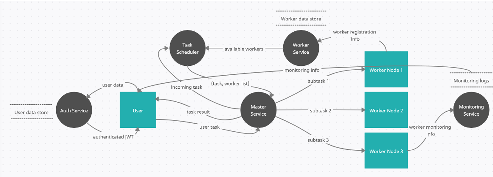
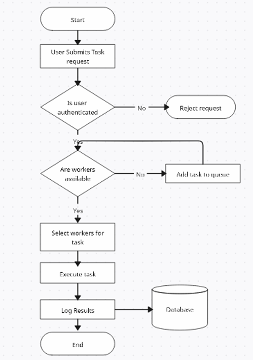
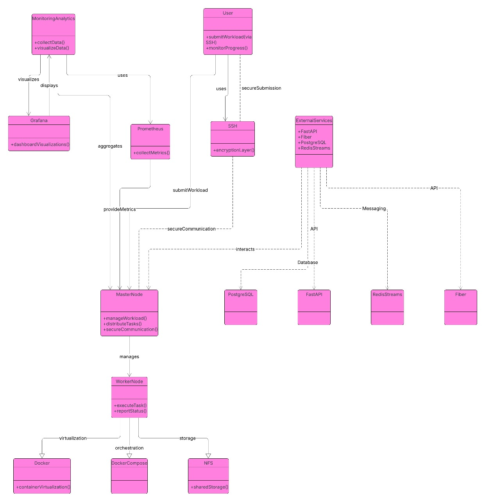

# 🌐 **High-Level Design (HLD)**

## 🧭 1. Introduction

**Cloud Odyssey** is a decentralized, high-performance distributed computing framework based on a microservices
architecture. It leverages idle computational resources through dynamic orchestration into a Beowulf cluster, enabling
seamless task scheduling, execution, and monitoring across multiple nodes. The goal is to create a scalable,
cost-effective alternative to traditional centralized cloud infrastructure.

### 🎯 1.1 Purpose

The objective of Cloud Odyssey is to establish a modular and secure system for distributed parallel computing. Built
using RESTful microservices and robust orchestration tools like OpenMPI and SLURM, the system ensures flexible
deployment and optimal resource usage.

### 📦 1.2 Scope

Cloud Odyssey includes several core microservices—**Authentication**, **Task Scheduler**, **Worker**, **Master**, and **
Monitoring**—interacting via REST APIs. Each component is containerized and deployed using Kubernetes with CI/CD
automation.

### 🔗 1.3 References

- [Software Requirements Specification (SRS)](./SRS.md)
- [Project GitHub Repository](https://github.com/DaveVaishnavi/Cloud-Odyssey)

---

## 🏗️ 2. System Overview

### 🧰 2.1 Dataflow Diagram

### 🧰 2.2 Flowchart

### 🧰 2.3 UML Diagram

### 🔍 2.4 High-Level Component Description

| Component           | Description |
|---------------------|-------------|
| **Authentication Service** | Manages secure login, registration, and token-based auth (JWT/OAuth2). |
| **Task Scheduler Service** | Distributes jobs using Round Robin, SJF, and Weighted Scheduling algorithms. |
| **Worker Service**         | Registers workers and reports health status. |
| **Master Service**         | Executes tasks over SSH and aggregates results. |
| **Monitoring Service**     | Tracks system metrics and logs via Prometheus + Grafana. |

---

## 🧩 3. Module Design

### 🔐 3.1 Authentication Service

- **Description**: Provides secure access to the system.
- **Responsibilities**: User registration, login, logout, token issuance.
- **Interacting Components**: Scheduler, Monitoring.
- **Technology Used**: Go, Gin, JWT.

### 🗓️ 3.2 Task Scheduler Service

- **Description**: Manages task queues and assigns workers.
- **Responsibilities**: Job scheduling, resource balancing.
- **Interacting Components**: Master, Worker.
- **Technology Used**: Go, Redis Streams.

### ⚙️3.3 Worker Service

- **Description**: Maintains dynamic node pool.
- **Responsibilities**: Worker registration, status checks.
- **Interacting Components**: Scheduler, Monitoring.
- **Technology Used**: Fiber (Go), Docker.

### 🧠 3.4 Master Service

- **Description**: Orchestrates actual task execution.
- **Responsibilities**: Task execution, result collation.
- **Interacting Components**: Scheduler, Worker.
- **Technology Used**: SSH, FastAPI.

### 📈 3.5 Monitoring Service

- **Description**: Collects metrics and health status.
- **Responsibilities**: Alerting, log streaming.
- **Interacting Components**: All components.
- **Technology Used**: Prometheus, Grafana, FastAPI.

---

## 🔐 4. Security Considerations

- **Authentication & Authorization**: JWT-based; optionally OAuth2 + Keycloak for IAM.
- **Data Protection**: TLS encryption, nightly backups, encrypted tokens.
- **Network Security**: API gateway, firewalls, mutual TLS for worker registration.

---

## ⚡ 5. Performance & Reliability

- **Expected Load**: ~1000 tasks/day, 5–15 worker nodes.
- **Failure Handling**: Retry policies, backup workers, task reassignment.
- **Logging & Monitoring**: Prometheus + Grafana dashboards, alert rules.

---

## 📌 6. Assumptions & Constraints

- All nodes maintain ≥ 8GB RAM and high-speed networking.
- Execution relies on SSH; exposed ports must be secured.
- Docker must be pre-installed on all worker nodes.

---

## 📎 7. Appendices

- 🔗 [Feasibility Study Report](../assets/PDF/Feasibility Study Report.pdf)
- 💡 [Project Proposal](../assets/PDF/Project Proposal.pdf)
- 📜 [Requirements Document](../assets/PDF/Requirements and Specification Document.pdf)

